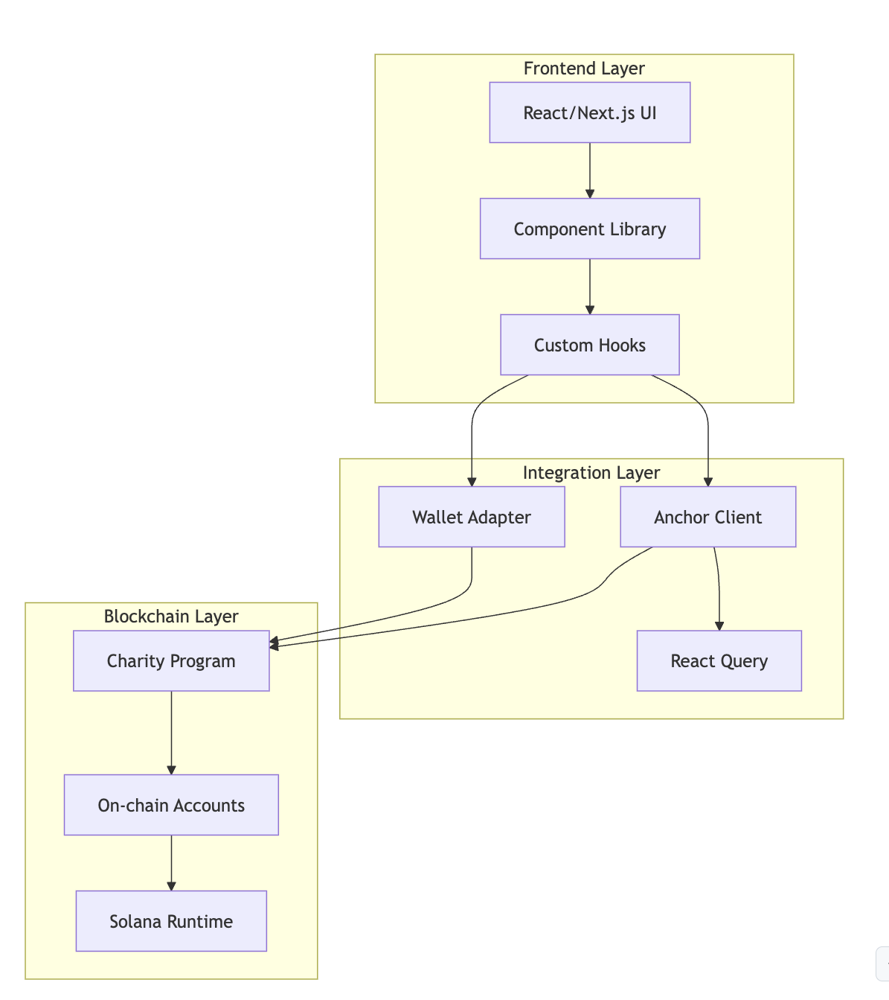
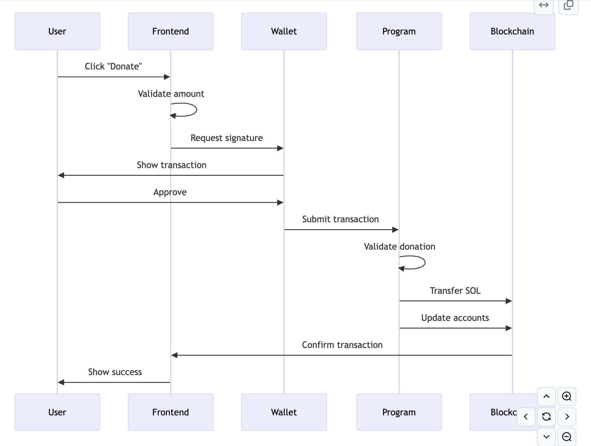
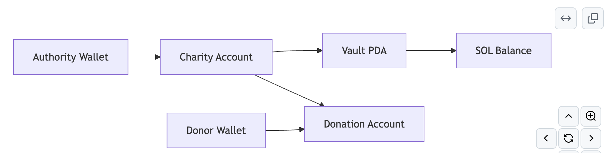

# System Architecture

The Solana Charity dApp is built with a modern, scalable architecture that demonstrates best practices for full-stack blockchain development. This section provides a comprehensive overview of how all the components work together.

## High-Level Architecture

The system follows a three-tier architecture with a Rust/Anchor smart contract layer on Solana, a TypeScript/React frontend, and custom data access hooks bridging blockchain interactions with the user interface.



## Core Components

### 1. Smart Contract Layer (Rust/Anchor)

**Location**: `anchor/programs/charity/`

A Rust/Anchor Solana program managing charity accounts, donations, withdrawals, and transparent event logging.

### 2. Frontend Application (TypeScript/React)

**Location**: `src/`

A modern React application built with Next.js 14, showcasing contemporary web development practices.

### 3. Data Access Layer

**Location**: `src/components/charity/data-access/`

Custom React hooks that abstract blockchain interactions and provide a clean API for the UI components.

**Key Hooks**:
- `useProgram()` - Core program interactions
- `useAccount()` - Charity account management
- `useDonation()` - Donation operations
- `useBalance()` - Wallet balance tracking

## Data Flow Architecture

### Donation Flow Example



## Account Architecture

### Program Derived Addresses (PDAs)

The application uses PDAs for deterministic account addresses:

```rust
// Charity PDA
[b"charity", authority.key().as_ref(), name.as_bytes()] -> Charity Account

// Vault PDA
[b"vault", charity.key().as_ref()] -> Vault Account

// Donation PDA
[b"donation", donor.key(), charity.key(), &charity.donation_count.to_le_bytes()] -> Donation Record
```

### Account Relationships



The diagram shows how accounts are connected: Authority Wallets create and control Charity Accounts, which link to Vault PDAs that store SOL balances. Donor Wallets create Donation Accounts that reference the receiving charity.

## Security Architecture

The system ensures security through authority-based access control, program-owned fund storage, immutable smart contract logic, and transparent on-chain operations with full public auditability.

## State Management

### On-Chain State

```rust
// Charity account structure
pub struct Charity {
    pub authority: Pubkey,           // Owner's wallet
    pub name: String,                // Charity name
    pub description: String,         // Description
    pub donations_in_lamports: u64,  // Total raised
    pub donation_count: u32,         // Number of donations
    pub paused: bool,                // Donation status
    pub created_at: i64,             // Creation timestamp
    pub updated_at: i64,             // Last update
    pub vault_bump: u8,              // PDA bump seed
}
```

## Next Steps

Dive deeper into specific architectural components:

- **[Smart Contract Architecture](smart-contract.md)** - Detailed program structure
- **[Frontend Architecture](frontend.md)** - React application design
- **[Data Flow](data-flow.md)** - How data moves through the system
- **[Security Model](security.md)** - Security considerations and best practices

This architecture enables the charity dApp to be secure, scalable, and maintainable while showcasing modern blockchain development practices.
