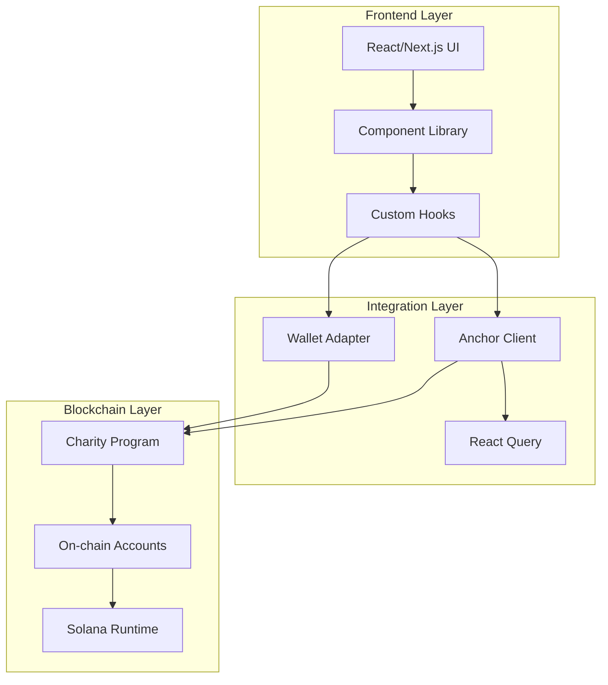
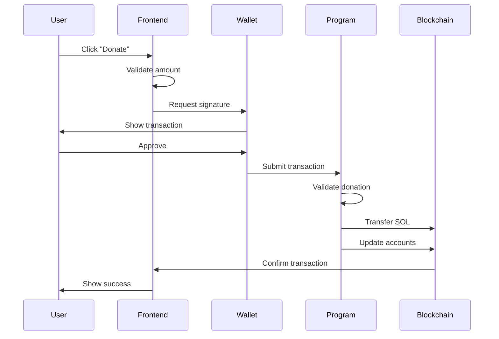
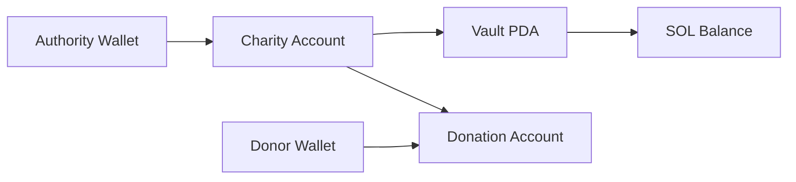

# System Architecture

The Solana Charity dApp is built with a modern, scalable architecture that demonstrates best practices for full-stack blockchain development. This section provides a comprehensive overview of how all the components work together.

## High-Level Architecture



## Core Components

### 1. Smart Contract Layer (Rust/Anchor)

**Location**: `anchor/programs/charity/`

The heart of the application is a Solana program written in Rust using the Anchor framework.

**Key Features**:
- Charity account management
- Secure donation handling
- Fund withdrawal mechanisms
- Event logging for transparency
- Comprehensive error handling

**Program Structure**:
```rust
charity/
├── src/
│   ├── lib.rs              # Main program entry point
│   ├── instructions/       # All program instructions
│   ├── state/             # Account structures
│   └── common/            # Shared utilities, errors, events
```

### 2. Frontend Application (TypeScript/React)

**Location**: `src/`

A modern React application built with Next.js 14, showcasing contemporary web development practices.

**Technology Stack**:
- **Framework**: Next.js 14 with App Router
- **Language**: TypeScript for type safety
- **Styling**: Tailwind CSS + DaisyUI
- **State Management**: React Query + Jotai
- **Blockchain Integration**: Solana Wallet Adapter

### 3. Data Access Layer

**Location**: `src/components/charity/data-access/`

Custom React hooks that abstract blockchain interactions and provide a clean API for the UI components.

**Key Hooks**:
- `useProgram()` - Core program interactions
- `useAccount()` - Charity account management
- `useDonation()` - Donation operations
- `useBalance()` - Wallet balance tracking

## Data Flow Architecture

### Donation Flow Example



## Account Architecture

### Program Derived Addresses (PDAs)

The application uses PDAs for deterministic account addresses:

```rust
// Charity PDA
[b"charity", authority.key(), name.as_bytes()] -> Charity Account

// Vault PDA  
[b"vault", charity_pda.key()] -> Vault Account

// Donation PDA
[b"donation", donor.key(), charity.key(), timestamp] -> Donation Record
```

### Account Relationships



## Security Architecture

### Access Control

- **Charity Management**: Only charity authority can update, pause, or delete
- **Fund Security**: Donations stored in program-owned PDAs
- **Withdrawal Protection**: Maintains rent-exempt balance
- **Input Validation**: All inputs validated on-chain

### Trust Model

1. **Program Immutability**: Smart contract logic cannot be changed
2. **Transparent Transactions**: All operations recorded on-chain
3. **Decentralized Storage**: No central database dependencies
4. **Open Source**: All code publicly auditable

## State Management

### On-Chain State

```rust
// Charity account structure
pub struct Charity {
    pub authority: Pubkey,           // Owner's wallet
    pub name: String,                // Charity name
    pub description: String,         // Description
    pub donations_in_lamports: u64,  // Total raised
    pub donation_count: u32,         // Number of donations
    pub paused: bool,               // Donation status
    pub created_at: i64,            // Creation timestamp
    pub updated_at: i64,            // Last update
    pub vault_bump: u8,             // PDA bump seed
}
```

### Off-Chain State

- **React Query**: Caches blockchain data and manages loading states
- **Jotai**: Global state for wallet connection and UI preferences
- **Local Storage**: User preferences and session data

## Performance Considerations

### Blockchain Optimization

- **Batch Operations**: Multiple updates in single transactions
- **Efficient PDAs**: Deterministic addressing reduces RPC calls
- **Event Logging**: Structured events for efficient indexing
- **Rent Optimization**: Accounts sized for rent exemption

### Frontend Optimization

- **Code Splitting**: Dynamic imports for wallet adapters
- **Data Caching**: React Query with stale-while-revalidate
- **Optimistic Updates**: UI updates before blockchain confirmation
- **Error Boundaries**: Graceful error handling

## Scalability Architecture

### Current Capabilities

- **Concurrent Users**: Handles multiple simultaneous donations
- **Charity Limit**: Unlimited charities per authority
- **Transaction Throughput**: Limited by Solana network capacity
- **Data Storage**: On-chain storage for critical data only

### Future Scaling Strategies

- **Off-chain Indexing**: GraphQL/REST API for complex queries
- **IPFS Integration**: Decentralized storage for rich media
- **Layer 2 Solutions**: State channels for micro-donations
- **Cross-chain Support**: Multi-blockchain charity platform

## Development Architecture

### Local Development

```bash
# Three-tier development setup
1. Solana Validator (localhost:8899)  # Blockchain layer
2. Anchor Program Deploy              # Smart contract
3. Next.js Dev Server (localhost:3000) # Frontend layer
```

### Testing Strategy

- **Unit Tests**: Individual function testing
- **Integration Tests**: Full instruction flows
- **End-to-End Tests**: Complete user journeys
- **Stress Tests**: High-load scenarios

## Deployment Architecture

### Development Environment
- **Blockchain**: Solana Test Validator (Local)
- **Frontend**: Next.js Dev Server
- **Database**: On-chain only

### Production Environment
- **Blockchain**: Solana Mainnet/Devnet
- **Frontend**: Vercel/Netlify deployment
- **CDN**: Static asset optimization
- **Monitoring**: Transaction and error tracking

## Key Design Decisions

### Why Anchor Framework?

- **Developer Experience**: Simplified Solana development
- **Type Safety**: Rust's type system prevents common errors
- **Testing Tools**: Built-in testing framework
- **Client Generation**: Automatic TypeScript client

### Why Next.js?

- **Performance**: Server-side rendering and optimization
- **Developer Experience**: Hot reload and TypeScript support
- **Deployment**: Easy deployment to Vercel
- **SEO**: Better search engine optimization

### Why React Query?

- **Data Synchronization**: Keeps UI in sync with blockchain
- **Caching Strategy**: Reduces redundant RPC calls
- **Loading States**: Built-in loading and error states
- **Offline Support**: Graceful degradation

## Next Steps

Dive deeper into specific architectural components:

- **[Smart Contract Architecture](smart-contract.md)** - Detailed program structure
- **[Frontend Architecture](frontend.md)** - React application design
- **[Data Flow](data-flow.md)** - How data moves through the system
- **[Security Model](security.md)** - Security considerations and best practices

This architecture enables the charity dApp to be secure, scalable, and maintainable while showcasing modern blockchain development practices.