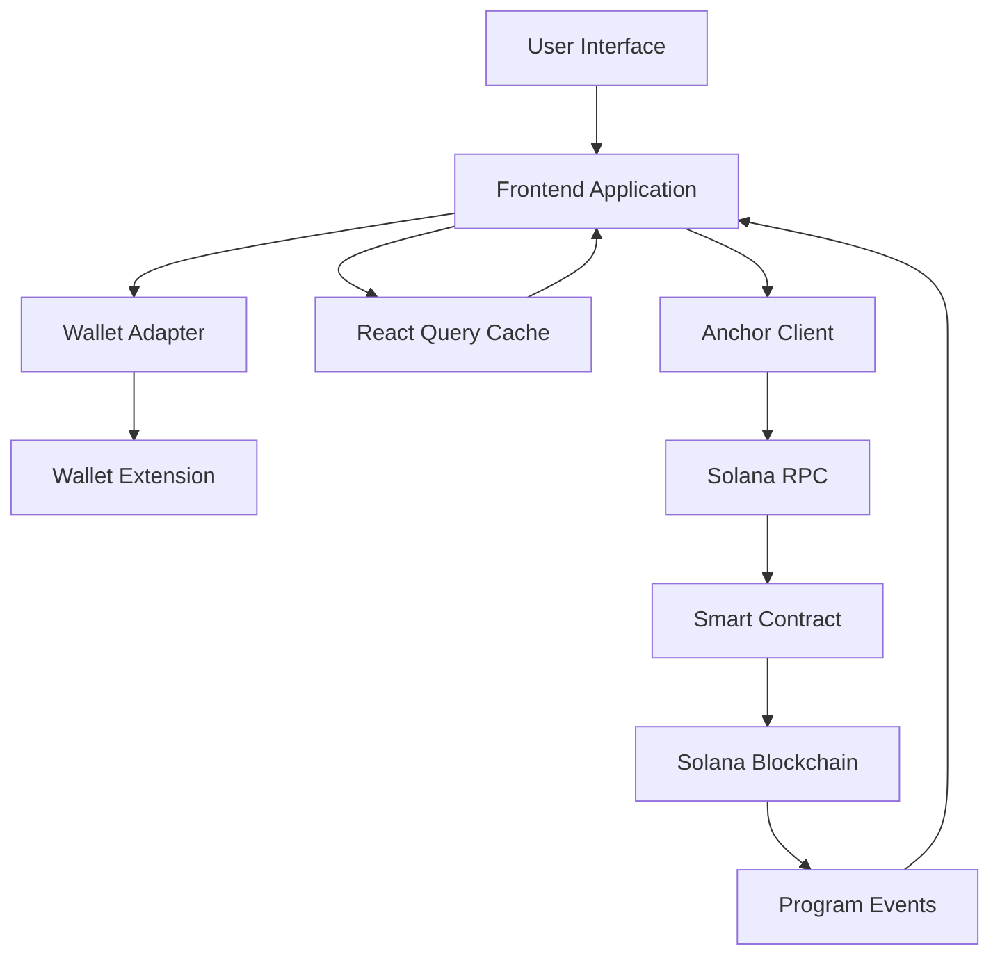
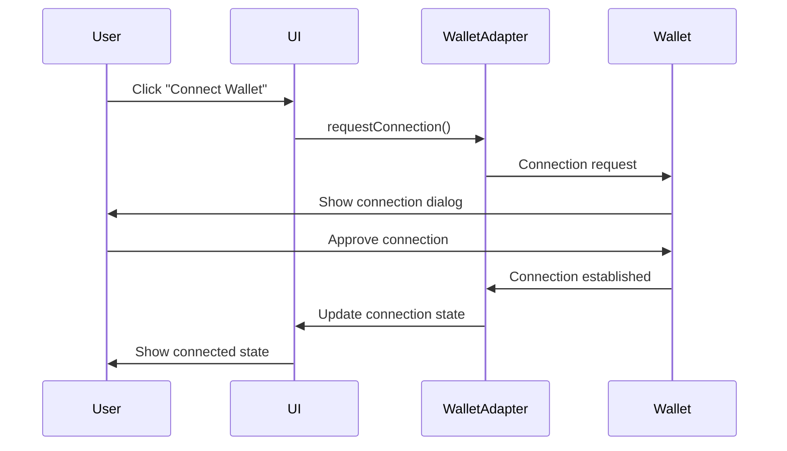
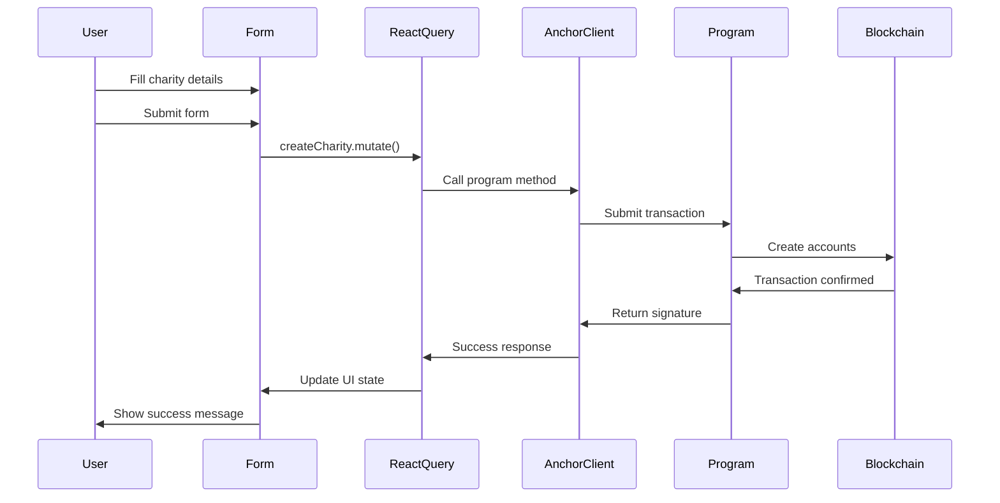
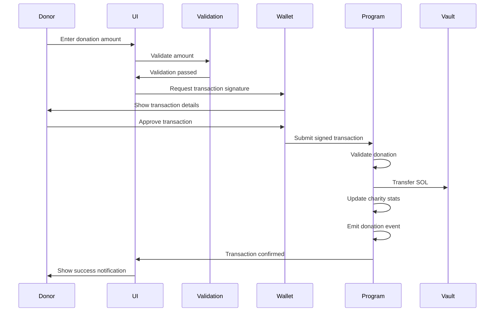
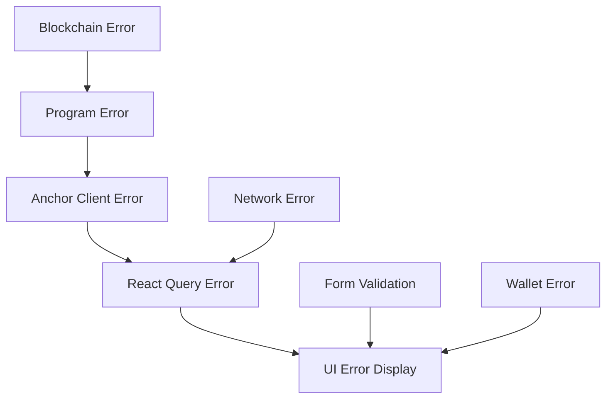

# Data Flow

This section explains how data moves through the charity dApp system, from user interactions to blockchain transactions and back to the UI.

## Overall Data Flow Architecture



## User Interaction Flows

### 1. Wallet Connection Flow



### 2. Charity Creation Flow



### 3. Donation Flow



## Data Synchronization

### React Query Cache Strategy

```typescript
// Query configuration for automatic synchronization
const getAllCharities = useQuery({
  queryKey: ['charity', 'allCharities', { cluster }],
  queryFn: fetchCharities,
  staleTime: 30000,      // Data fresh for 30 seconds
  refetchInterval: 60000, // Refetch every minute
  refetchOnWindowFocus: true,
  refetchOnMount: true,
});
```

### Cache Invalidation

```typescript
// Invalidate cache after mutations
const createCharity = useMutation({
  mutationFn: createCharityTx,
  onSuccess: () => {
    // Invalidate and refetch charity list
    queryClient.invalidateQueries({ queryKey: ['charity'] });
    // Invalidate account balance
    queryClient.invalidateQueries({ queryKey: ['account', publicKey] });
  },
});
```

## Real-time Updates

### Event Listening

```typescript
// Listen for program events
useEffect(() => {
  if (!program) return;
  
  const listener = program.addEventListener('MakeDonationEvent', (event) => {
    // Update UI with new donation
    queryClient.setQueryData(['charity', event.charityKey], (old) => ({
      ...old,
      donations_in_lamports: event.totalDonations,
      donation_count: event.donationCount,
    }));
  });
  
  return () => {
    program.removeEventListener(listener);
  };
}, [program, queryClient]);
```

### Optimistic Updates

```typescript
const donate = useMutation({
  mutationFn: donateTx,
  onMutate: async (variables) => {
    // Cancel outgoing refetches
    await queryClient.cancelQueries({ queryKey: ['charity', charityKey] });
    
    // Snapshot previous value
    const previousCharity = queryClient.getQueryData(['charity', charityKey]);
    
    // Optimistically update to new state
    queryClient.setQueryData(['charity', charityKey], (old) => ({
      ...old,
      donations_in_lamports: old.donations_in_lamports + variables.amount,
      donation_count: old.donation_count + 1,
    }));
    
    return { previousCharity };
  },
  onError: (err, variables, context) => {
    // Rollback on error
    queryClient.setQueryData(['charity', charityKey], context.previousCharity);
  },
  onSettled: () => {
    // Refetch after mutation
    queryClient.invalidateQueries({ queryKey: ['charity', charityKey] });
  },
});
```

## Error Data Flow

### Error Propagation Chain



### Error Handling Strategy

```typescript
// Centralized error handling
const handleError = (error: any) => {
  if (error.code === 'UserRejectedRequest') {
    toast.info('Transaction cancelled by user');
  } else if (error.message.includes('DonationsPaused')) {
    toast.error('Donations are currently paused for this charity');
  } else if (error.message.includes('InsufficientFunds')) {
    toast.error('Insufficient funds for this transaction');
  } else {
    toast.error('Transaction failed. Please try again.');
    console.error('Unexpected error:', error);
  }
};
```

## Performance Data Flow

### Loading States

```typescript
// Hierarchical loading states
const CharityList = () => {
  const { data: charities, isLoading, error } = useGetAllCharities();
  
  if (isLoading) return <LoadingSpinner />;
  if (error) return <ErrorMessage error={error} />;
  
  return (
    <div>
      {charities.map(charity => (
        <CharityCard key={charity.publicKey} charity={charity} />
      ))}
    </div>
  );
};
```

### Background Refetching

```typescript
// Silent background updates
const useCharityWithRefresh = (charityKey) => {
  return useQuery({
    queryKey: ['charity', charityKey],
    queryFn: () => fetchCharity(charityKey),
    refetchInterval: 30000, // Refresh every 30 seconds
    refetchIntervalInBackground: true,
  });
};
```

## Data Transformation Pipeline

### Raw Data to UI Data

```typescript
// Transform blockchain data for UI consumption
const transformCharity = (rawCharity: any) => ({
  ...rawCharity,
  // Convert lamports to SOL for display
  donationsInSol: rawCharity.donations_in_lamports / LAMPORTS_PER_SOL,
  // Format timestamps
  createdAtFormatted: new Date(rawCharity.created_at * 1000).toLocaleDateString(),
  // Calculate derived fields
  averageDonation: rawCharity.donation_count > 0 
    ? rawCharity.donations_in_lamports / rawCharity.donation_count / LAMPORTS_PER_SOL
    : 0,
});
```

### Form Data to Transaction Data

```typescript
// Transform form inputs to transaction parameters
const transformCreateCharity = (formData: CreateCharityForm) => ({
  name: formData.name.trim(),
  description: formData.description.trim(),
  // Additional validation and transformation
});
```

## Data Persistence

### Local Storage Strategy

```typescript
// Persist user preferences
const usePersistedSettings = () => {
  const [settings, setSettings] = useState(() => {
    const saved = localStorage.getItem('charity-app-settings');
    return saved ? JSON.parse(saved) : defaultSettings;
  });
  
  useEffect(() => {
    localStorage.setItem('charity-app-settings', JSON.stringify(settings));
  }, [settings]);
  
  return [settings, setSettings];
};
```

### Session State Management

```typescript
// Manage temporary session data
const useSessionState = () => {
  const [sessionData, setSessionData] = useAtom(sessionAtom);
  
  // Clear session on wallet disconnect
  useEffect(() => {
    if (!connected) {
      setSessionData(null);
    }
  }, [connected]);
  
  return [sessionData, setSessionData];
};
```

This data flow architecture ensures efficient, reliable, and responsive user experiences while maintaining data consistency across all application layers.