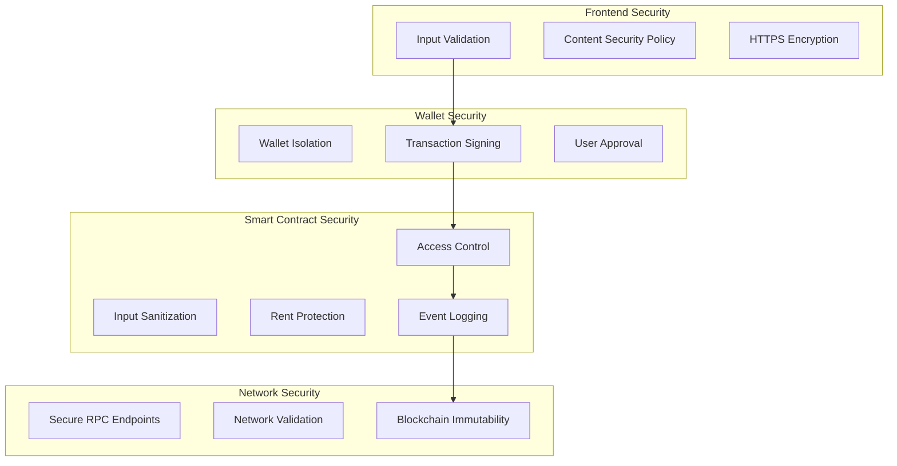

# Security Model

The charity dApp implements a comprehensive security model that protects user funds, ensures data integrity, and prevents common attack vectors in blockchain applications.

## Security Architecture Overview



## Frontend Security

### Input Validation & Sanitization

```typescript
// Form validation schema with Zod
const createCharitySchema = z.object({
  name: z.string()
    .min(1, "Name is required")
    .max(50, "Name must be 50 characters or less")
    .regex(/^[a-zA-Z0-9\s\-_]+$/, "Name contains invalid characters"),
  description: z.string()
    .min(1, "Description is required")
    .max(200, "Description must be 200 characters or less")
    .refine((val) => !val.includes('<script'), "Invalid content detected"),
});

// Amount validation for donations
const donationSchema = z.object({
  amount: z.number()
    .positive("Amount must be positive")
    .max(1000, "Maximum donation is 1000 SOL")
    .refine((val) => val >= 0.001, "Minimum donation is 0.001 SOL"),
});
```

### XSS Prevention

```typescript
// Content sanitization
import DOMPurify from 'dompurify';

const sanitizeHTML = (dirty: string): string => {
  return DOMPurify.sanitize(dirty, {
    ALLOWED_TAGS: ['b', 'i', 'em', 'strong', 'p', 'br'],
    ALLOWED_ATTR: [],
  });
};

// Safe HTML rendering
const CharityDescription = ({ description }: { description: string }) => (
  <div 
    dangerouslySetInnerHTML={{ 
      __html: sanitizeHTML(description) 
    }} 
  />
);
```

### Content Security Policy

```typescript
// Next.js security headers
const securityHeaders = [
  {
    key: 'Content-Security-Policy',
    value: `
      default-src 'self';
      script-src 'self' 'unsafe-eval' 'unsafe-inline';
      style-src 'self' 'unsafe-inline';
      img-src 'self' data: https:;
      connect-src 'self' https://api.mainnet-beta.solana.com https://api.devnet.solana.com;
      font-src 'self';
    `.replace(/\s{2,}/g, ' ').trim()
  },
  {
    key: 'X-Frame-Options',
    value: 'DENY'
  },
  {
    key: 'X-Content-Type-Options',
    value: 'nosniff'
  },
  {
    key: 'Referrer-Policy',
    value: 'origin-when-cross-origin'
  }
];
```

## Wallet Security

### Wallet Isolation

```typescript
// Secure wallet connection
const WalletProvider = ({ children }) => {
  const wallets = useMemo(
    () => [
      new PhantomWalletAdapter(),
      new SolflareWalletAdapter(),
      new BackpackWalletAdapter(),
    ],
    []
  );

  return (
    <ConnectionProvider endpoint={endpoint}>
      <WalletProvider 
        wallets={wallets} 
        autoConnect={false} // Prevent automatic connections
      >
        <WalletModalProvider>
          {children}
        </WalletModalProvider>
      </WalletProvider>
    </ConnectionProvider>
  );
};
```

### Transaction Verification

```typescript
// Verify transaction before signing
const verifyTransaction = async (transaction: Transaction) => {
  // Verify program ID
  const expectedProgramId = new PublicKey(CHARITY_PROGRAM_ID);
  const instructions = transaction.instructions;
  
  for (const instruction of instructions) {
    if (!instruction.programId.equals(expectedProgramId)) {
      throw new Error('Unauthorized program detected');
    }
  }
  
  // Verify instruction data integrity
  const decodedInstructions = instructions.map(ix => 
    program.coder.instruction.decode(ix.data)
  );
  
  return decodedInstructions;
};
```

### User Approval Flow

```typescript
// Explicit user confirmation for sensitive operations
const confirmTransaction = async (operation: string, details: any) => {
  const confirmed = await showConfirmationDialog({
    title: `Confirm ${operation}`,
    message: `You are about to ${operation.toLowerCase()}`,
    details: details,
    risks: getOperationRisks(operation),
  });
  
  if (!confirmed) {
    throw new Error('Transaction cancelled by user');
  }
  
  return confirmed;
};
```

## Smart Contract Security

### Access Control Implementation

```rust
// Authority-based access control
#[derive(Accounts)]
pub struct UpdateCharity<'info> {
    #[account(
        mut,
        has_one = authority @ CustomError::Unauthorized,
        seeds = [b"charity", authority.key().as_ref(), charity.name.as_bytes()],
        bump = charity.vault_bump
    )]
    pub charity: Account<'info, Charity>,
    
    pub authority: Signer<'info>,
}

// Implement custom authorization
pub fn update_charity(
    ctx: Context<UpdateCharity>,
    description: String,
) -> Result<()> {
    let charity = &mut ctx.accounts.charity;
    
    // Additional business logic checks
    require!(!charity.deleted_at.is_some(), CustomError::CharityDeleted);
    require!(description.len() <= MAX_DESCRIPTION_LEN, CustomError::InvalidDescriptionLength);
    
    charity.description = description;
    charity.updated_at = Clock::get()?.unix_timestamp;
    
    Ok(())
}
```

### Input Validation & Bounds Checking

```rust
// Comprehensive input validation
pub fn donate_sol(ctx: Context<DonateSol>, amount: u64) -> Result<()> {
    let charity = &mut ctx.accounts.charity;
    let vault = &ctx.accounts.vault;
    let donor = &ctx.accounts.donor;
    
    // Validate donation state
    require!(!charity.paused, CustomError::DonationsPaused);
    require!(!charity.deleted_at.is_some(), CustomError::CharityDeleted);
    
    // Validate amount bounds
    require!(amount > 0, CustomError::InvalidAmount);
    require!(amount <= MAX_DONATION_AMOUNT, CustomError::ExcessiveDonation);
    require!(amount >= MIN_DONATION_AMOUNT, CustomError::InsufficientDonation);
    
    // Validate donor balance
    let donor_balance = donor.lamports();
    require!(donor_balance >= amount, CustomError::InsufficientFunds);
    
    // Prevent overflow in charity totals
    let new_total = charity.donations_in_lamports
        .checked_add(amount)
        .ok_or(CustomError::Overflow)?;
    
    let new_count = charity.donation_count
        .checked_add(1)
        .ok_or(CustomError::Overflow)?;
    
    // Execute transfer
    system_program::transfer(
        CpiContext::new(
            ctx.accounts.system_program.to_account_info(),
            system_program::Transfer {
                from: donor.to_account_info(),
                to: vault.to_account_info(),
            },
        ),
        amount,
    )?;
    
    // Update charity state
    charity.donations_in_lamports = new_total;
    charity.donation_count = new_count;
    charity.updated_at = Clock::get()?.unix_timestamp;
    
    // Emit event for transparency
    emit!(MakeDonationEvent {
        donor_key: donor.key(),
        charity_key: charity.key(),
        charity_name: charity.name.clone(),
        amount,
        total_donations: new_total,
        donation_count: new_count,
        created_at: charity.updated_at,
    });
    
    Ok(())
}
```

### Rent Protection

```rust
// Ensure accounts maintain rent exemption
pub fn withdraw_donations(
    ctx: Context<WithdrawDonations>,
    amount: u64,
) -> Result<()> {
    let charity = &mut ctx.accounts.charity;
    let vault = &mut ctx.accounts.vault;
    let authority = &ctx.accounts.authority;
    
    // Calculate minimum rent required
    let rent_minimum = Rent::get()?.minimum_balance(0);
    let vault_balance = vault.lamports();
    
    // Ensure sufficient balance after withdrawal
    require!(
        vault_balance >= amount.checked_add(rent_minimum).unwrap(),
        CustomError::InsufficientFundsForRent
    );
    
    // Prevent excessive withdrawals
    require!(amount <= vault_balance - rent_minimum, CustomError::ExcessiveWithdrawal);
    
    // Execute withdrawal
    **vault.to_account_info().try_borrow_mut_lamports()? -= amount;
    **authority.to_account_info().try_borrow_mut_lamports()? += amount;
    
    charity.withdrawn_at = Some(Clock::get()?.unix_timestamp);
    
    Ok(())
}
```

## Reentrancy Protection

```rust
// State updates before external calls
pub fn complex_operation(ctx: Context<ComplexOperation>) -> Result<()> {
    let account = &mut ctx.accounts.account;
    
    // Update state BEFORE external calls
    account.operation_in_progress = true;
    account.last_operation = Clock::get()?.unix_timestamp;
    
    // Check for reentrancy
    require!(!account.operation_in_progress, CustomError::ReentrancyDetected);
    
    // Perform external operations
    system_program::transfer(/* ... */)?;
    
    // Clear operation flag
    account.operation_in_progress = false;
    
    Ok(())
}
```

## Event Logging for Audit Trail

```rust
// Comprehensive event logging
#[event]
pub struct SecurityEvent {
    pub event_type: String,
    pub account_key: Pubkey,
    pub authority: Pubkey,
    pub details: String,
    pub timestamp: i64,
    pub transaction_signature: String,
}

// Log security-relevant events
pub fn log_security_event(
    event_type: &str,
    account_key: &Pubkey,
    authority: &Pubkey,
    details: &str,
) -> Result<()> {
    emit!(SecurityEvent {
        event_type: event_type.to_string(),
        account_key: *account_key,
        authority: *authority,
        details: details.to_string(),
        timestamp: Clock::get()?.unix_timestamp,
        transaction_signature: "".to_string(), // Filled by runtime
    });
    
    Ok(())
}
```

## Network Security

### RPC Endpoint Validation

```typescript
// Validate RPC endpoints
const validateRPCEndpoint = (endpoint: string): boolean => {
  const allowedEndpoints = [
    'https://api.mainnet-beta.solana.com',
    'https://api.devnet.solana.com',
    'https://api.testnet.solana.com',
  ];
  
  return allowedEndpoints.includes(endpoint) || 
         endpoint.startsWith('http://localhost:');
};

// Secure connection setup
const connection = new Connection(
  validateRPCEndpoint(endpoint) ? endpoint : DEFAULT_ENDPOINT,
  {
    commitment: 'confirmed',
    confirmTransactionInitialTimeout: 60000,
  }
);
```

### Transaction Integrity

```typescript
// Verify transaction signatures
const verifyTransactionSignature = async (signature: string) => {
  try {
    const transaction = await connection.getTransaction(signature, {
      commitment: 'confirmed',
    });
    
    if (!transaction) {
      throw new Error('Transaction not found');
    }
    
    if (transaction.meta?.err) {
      throw new Error(`Transaction failed: ${transaction.meta.err}`);
    }
    
    return transaction;
  } catch (error) {
    console.error('Transaction verification failed:', error);
    throw error;
  }
};
```

## Security Monitoring

### Error Tracking

```typescript
// Security-focused error tracking
const trackSecurityEvent = (event: SecurityEvent) => {
  // Log to monitoring service
  console.warn('Security Event:', {
    type: event.type,
    severity: event.severity,
    timestamp: new Date().toISOString(),
    details: event.details,
    userAgent: navigator.userAgent,
    url: window.location.href,
  });
  
  // Alert for critical events
  if (event.severity === 'critical') {
    // Send to security monitoring system
    notifySecurityTeam(event);
  }
};
```

### Rate Limiting

```typescript
// Implement client-side rate limiting
const rateLimiter = new Map<string, number>();

const checkRateLimit = (operation: string, limit: number = 10) => {
  const key = `${operation}_${Date.now()}`;
  const count = rateLimiter.get(key) || 0;
  
  if (count >= limit) {
    throw new Error('Rate limit exceeded. Please wait before retrying.');
  }
  
  rateLimiter.set(key, count + 1);
  
  // Clean up old entries
  setTimeout(() => rateLimiter.delete(key), 60000);
};
```

## Security Best Practices

### Development Guidelines

1. **Input Validation**: Always validate and sanitize user inputs
2. **Access Control**: Implement proper authorization checks
3. **Error Handling**: Don't expose sensitive information in errors
4. **Logging**: Log security-relevant events for audit trails
5. **Testing**: Include security test cases in test suites

### Deployment Security

1. **Environment Variables**: Never commit secrets to version control
2. **HTTPS**: Always use encrypted connections in production
3. **CSP Headers**: Implement Content Security Policy
4. **Dependency Scanning**: Regularly scan for vulnerable dependencies

### User Education

1. **Wallet Security**: Educate users about wallet security
2. **Phishing Protection**: Warn about suspicious websites
3. **Transaction Verification**: Encourage users to verify transactions
4. **Private Key Safety**: Never ask for private keys or seed phrases

This comprehensive security model ensures the charity dApp maintains the highest standards of security while providing a seamless user experience.