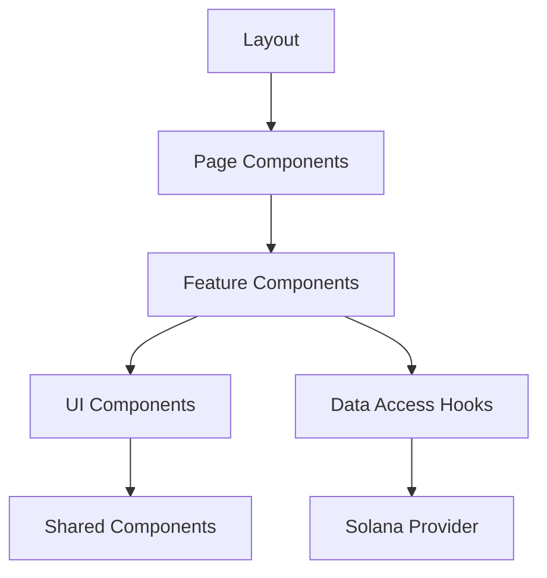

# Frontend Application

The Solana Charity dApp frontend is a modern React application built with Next.js 14, showcasing contemporary web development practices and seamless blockchain integration. This section explores the frontend architecture, design decisions, and implementation details.

## Technology Stack

### Core Framework
- **Next.js 14**: Latest version with App Router for optimal performance
- **React 18**: Modern React with concurrent features
- **TypeScript**: Full type safety throughout the application

### Styling & UI
- **Tailwind CSS**: Utility-first CSS framework for rapid development
- **DaisyUI**: Component library built on Tailwind CSS
- **Lucide React**: Modern icon library
- **Tabler Icons**: Additional icon set for blockchain-specific icons

### State Management
- **React Query (TanStack Query)**: Server state management and caching
- **Jotai**: Atomic state management for global UI state
- **React Hook Form**: Form state management with validation

### Blockchain Integration
- **Solana Wallet Adapter**: Wallet connection and transaction signing
- **Anchor Client**: Type-safe program interactions
- **Solana Web3.js**: Low-level blockchain operations

## Project Structure

```
src/
├── app/                          # Next.js 14 App Router
│   ├── layout.tsx               # Root layout component
│   ├── page.tsx                 # Home page
│   ├── globals.css              # Global styles
│   ├── charity/                 # Charity-related pages
│   │   ├── page.tsx            # Charity listing page
│   │   └── [charityId]/        # Dynamic charity detail pages
│   ├── account/                 # Account pages
│   └── api/                     # API routes
├── components/                   # Reusable components
│   ├── charity/                 # Charity-specific components
│   │   ├── data-access/        # Data fetching hooks
│   │   ├── feature/            # Feature components
│   │   ├── ui/                 # UI components
│   │   ├── types/              # TypeScript types
│   │   └── utils/              # Utility functions
│   ├── account/                # Account components
│   ├── cluster/                # Network cluster components
│   ├── solana/                 # Solana integration
│   └── ui/                     # Shared UI components
```

## Architecture Patterns

### Feature-Based Organization

Components are organized by feature rather than type:

```
components/charity/
├── data-access/        # Blockchain interaction hooks
├── feature/           # Complex feature components
├── ui/               # Simple UI components
├── types/            # TypeScript interfaces
└── utils/            # Feature-specific utilities
```

### Data Access Layer

Custom hooks abstract blockchain complexity:

```typescript
// useProgram hook provides all program interactions
export function useProgram() {
  const { connection } = useConnection();
  const { publicKey } = useWallet();
  const provider = useAnchorProvider();
  
  return {
    getAllCharities: useQuery({...}),
    createCharity: useMutation({...}),
    donate: useMutation({...}),
    // ... other operations
  };
}
```

### Component Hierarchy



## Key Components

### 1. Solana Provider (`solana-provider.tsx`)

Provides blockchain connectivity to the entire application:

```typescript
export function SolanaProvider({ children }: { children: React.ReactNode }) {
  return (
    <ConnectionProvider endpoint={endpoint}>
      <WalletProvider wallets={wallets} autoConnect>
        <WalletModalProvider>
          <AnchorProvider>
            {children}
          </AnchorProvider>
        </WalletModalProvider>
      </WalletProvider>
    </ConnectionProvider>
  );
}
```

### 2. Charity Data Access (`data-access.tsx`)

Centralizes all charity-related blockchain operations:

```typescript
export function useProgram() {
  // Program initialization
  const program = useMemo(
    () => getCharityProgram(provider, programId),
    [provider, programId]
  );

  // Queries
  const getAllCharities = useQuery({
    queryKey: ['charity', 'allCharities', { cluster }],
    queryFn: async () => {
      const accounts = await program.account.charity.all();
      return accounts.map(account => ({
        publicKey: account.publicKey,
        ...account.account,
      }));
    },
  });

  // Mutations
  const createCharity = useMutation({
    mutationFn: async ({ name, description }) => {
      return program.methods
        .createCharity(name, description)
        .accounts({ authority: publicKey })
        .rpc();
    },
    onSuccess: (signature) => {
      transactionToast(signature);
      queryClient.invalidateQueries({ queryKey: ['charity'] });
    },
  });

  return { getAllCharities, createCharity, /* ... */ };
}
```

### 3. Charity Feature Components

#### Charity List (`main.tsx`)

```typescript
export function CharityMainFeature() {
  const { getAllCharities, createCharity } = useProgram();
  const [showCreateForm, setShowCreateForm] = useState(false);

  return (
    <div className="space-y-6">
      <div className="flex justify-between items-center">
        <h1 className="text-3xl font-bold">Charities</h1>
        <button 
          onClick={() => setShowCreateForm(true)}
          className="btn btn-primary"
        >
          Create Charity
        </button>
      </div>

      {getAllCharities.data?.map(charity => (
        <CharityCard key={charity.publicKey.toString()} charity={charity} />
      ))}

      {showCreateForm && (
        <CreateCharityModal 
          onClose={() => setShowCreateForm(false)}
          onSubmit={createCharity.mutate}
        />
      )}
    </div>
  );
}
```

#### Charity Detail (`charity-detail.tsx`)

```typescript
export function CharityDetailFeature({ charityId }: { charityId: string }) {
  const charityKey = useMemo(() => new PublicKey(charityId), [charityId]);
  const { charityQuery, donationsQuery, vaultBalanceQuery } = useAccount(charityKey);
  const { donate, withdrawDonations, pauseDonations } = useProgram();

  const charity = charityQuery.data;
  const donations = donationsQuery.data || [];
  const vaultBalance = vaultBalanceQuery.data || 0;

  return (
    <div className="max-w-4xl mx-auto space-y-8">
      <CharityHeader charity={charity} />
      <CharityStats 
        charity={charity} 
        vaultBalance={vaultBalance}
        donationCount={donations.length}
      />
      <CharityActions
        charity={charity}
        onDonate={donate.mutate}
        onWithdraw={withdrawDonations.mutate}
        onPause={pauseDonations.mutate}
      />
      <DonationsList donations={donations} />
    </div>
  );
}
```

## State Management Strategy

### React Query for Server State

React Query handles all blockchain data:

```typescript
// Automatic caching and synchronization
const getAllCharities = useQuery({
  queryKey: ['charity', 'allCharities', { cluster }],
  queryFn: fetchCharities,
  staleTime: 30000,      // Data fresh for 30 seconds
  refetchInterval: 60000, // Refetch every minute
});
```

### Jotai for Client State

Jotai manages local UI state:

```typescript
// Global atoms for UI state
export const walletModalAtom = atom(false);
export const themeAtom = atom<'light' | 'dark'>('light');
export const clusterAtom = atom<Cluster>('devnet');
```

### Form State with React Hook Form

```typescript
const form = useForm<CreateCharityForm>({
  resolver: zodResolver(createCharitySchema),
  defaultValues: {
    name: '',
    description: '',
  },
});

const onSubmit = form.handleSubmit(async (data) => {
  await createCharity.mutateAsync(data);
  form.reset();
});
```

## UI/UX Design Principles

### Design System

**Color Palette**:
- Primary: Solana purple (#9945FF)
- Secondary: Complementary greens for success states
- Neutral: Grays for text and backgrounds
- Semantic: Standard colors for errors, warnings, info

**Typography**:
- Headings: Bold, clear hierarchy
- Body text: Readable, appropriate line height
- Code: Monospace for addresses and technical data

**Spacing**:
- Consistent 8px grid system
- Generous whitespace for breathing room
- Logical component grouping

### Component Design

**Cards**: Clean, shadowed containers for content grouping
```typescript
<div className="card bg-base-100 shadow-xl">
  <div className="card-body">
    <h2 className="card-title">{charity.name}</h2>
    <p>{charity.description}</p>
    <div className="card-actions justify-end">
      <button className="btn btn-primary">Donate</button>
    </div>
  </div>
</div>
```

**Buttons**: Consistent styling with semantic colors
```typescript
<button className="btn btn-primary">Primary Action</button>
<button className="btn btn-secondary">Secondary Action</button>
<button className="btn btn-outline">Outline Style</button>
```

**Forms**: Clean, accessible form controls
```typescript
<div className="form-control">
  <label className="label">
    <span className="label-text">Charity Name</span>
  </label>
  <input
    type="text"
    className="input input-bordered"
    {...register('name')}
  />
  {errors.name && (
    <label className="label">
      <span className="label-text-alt text-error">
        {errors.name.message}
      </span>
    </label>
  )}
</div>
```

## Responsive Design

### Mobile-First Approach

All components designed for mobile first, then enhanced for larger screens:

```typescript
<div className="grid grid-cols-1 md:grid-cols-2 lg:grid-cols-3 gap-6">
  {/* Responsive grid layout */}
</div>
```

### Breakpoint Strategy

- **Mobile**: < 768px - Single column, simplified navigation
- **Tablet**: 768px - 1024px - Two columns, expanded features
- **Desktop**: > 1024px - Full layout with sidebar and multiple columns

## Performance Optimizations

### Code Splitting

```typescript
// Dynamic imports for wallet adapters
const PhantomWalletAdapter = dynamic(
  () => import('@solana/wallet-adapter-phantom').then(mod => ({ default: mod.PhantomWalletAdapter })),
  { ssr: false }
);
```

### Image Optimization

```typescript
import Image from 'next/image';

<Image
  src="/charity-logo.png"
  alt="Charity Logo"
  width={200}
  height={200}
  className="object-cover rounded-lg"
  priority={false}
/>
```

### Bundle Optimization

```typescript
// Next.js configuration for optimal bundles
const nextConfig = {
  experimental: {
    optimizePackageImports: ['@solana/wallet-adapter-react'],
  },
  webpack: (config) => {
    config.resolve.fallback = {
      fs: false,
      net: false,
      tls: false,
    };
    return config;
  },
};
```

## Error Handling

### Error Boundaries

```typescript
export function ErrorBoundary({ children }: { children: React.ReactNode }) {
  return (
    <ErrorBoundaryPrimitive
      FallbackComponent={ErrorFallback}
      onError={(error, errorInfo) => {
        console.error('Error caught by boundary:', error, errorInfo);
      }}
    >
      {children}
    </ErrorBoundaryPrimitive>
  );
}
```

### Toast Notifications

```typescript
export function useTransactionToast() {
  return useCallback((signature: string) => {
    toast.success(
      <div>
        <p>Transaction confirmed!</p>
        <a 
          href={`https://explorer.solana.com/tx/${signature}`}
          target="_blank"
          rel="noopener noreferrer"
          className="text-blue-600 underline"
        >
          View on Explorer
        </a>
      </div>
    );
  }, []);
}
```

## Testing Strategy

### Component Testing

```typescript
import { render, screen } from '@testing-library/react';
import { CharityCard } from './charity-card';

test('renders charity information', () => {
  const charity = {
    name: 'Test Charity',
    description: 'Test Description',
    donations_in_lamports: 1000000000,
    donation_count: 5,
  };

  render(<CharityCard charity={charity} />);
  
  expect(screen.getByText('Test Charity')).toBeInTheDocument();
  expect(screen.getByText('1 SOL')).toBeInTheDocument();
  expect(screen.getByText('5 donations')).toBeInTheDocument();
});
```

### Integration Testing

```typescript
test('donation flow works correctly', async () => {
  const user = userEvent.setup();
  render(<CharityDetail charityId="test-charity-id" />);
  
  await user.click(screen.getByText('Donate'));
  await user.type(screen.getByLabelText('Amount'), '0.1');
  await user.click(screen.getByText('Confirm Donation'));
  
  await waitFor(() => {
    expect(screen.getByText('Donation successful')).toBeInTheDocument();
  });
});
```

## Accessibility

### ARIA Labels

```typescript
<button 
  aria-label={`Donate to ${charity.name}`}
  className="btn btn-primary"
>
  Donate
</button>
```

### Keyboard Navigation

All interactive elements support keyboard navigation:

```typescript
<div
  role="button"
  tabIndex={0}
  onKeyDown={(e) => {
    if (e.key === 'Enter' || e.key === ' ') {
      handleClick();
    }
  }}
  onClick={handleClick}
>
  Interactive Element
</div>
```

### Screen Reader Support

Semantic HTML and proper ARIA attributes ensure screen reader compatibility.

## Deployment

### Build Configuration

```json
{
  "scripts": {
    "build": "next build",
    "start": "next start",
    "export": "next export"
  }
}
```

### Environment Variables

```typescript
// Environment configuration
const config = {
  solanaNetwork: process.env.NEXT_PUBLIC_SOLANA_NETWORK || 'devnet',
  rpcUrl: process.env.NEXT_PUBLIC_RPC_URL || 'https://api.devnet.solana.com',
  programId: process.env.NEXT_PUBLIC_PROGRAM_ID,
};
```

## Next Steps

Explore specific frontend topics:

- **[Project Structure](structure.md)** - Detailed file organization
- **[Solana Integration](solana-integration.md)** - Blockchain connectivity
- **[Component Architecture](components.md)** - Component design patterns
- **[State Management](state-management.md)** - Data flow and state handling
- **[UI/UX Design](ui-ux.md)** - Design system and user experience

The frontend demonstrates modern React development practices while maintaining seamless integration with the Solana blockchain.