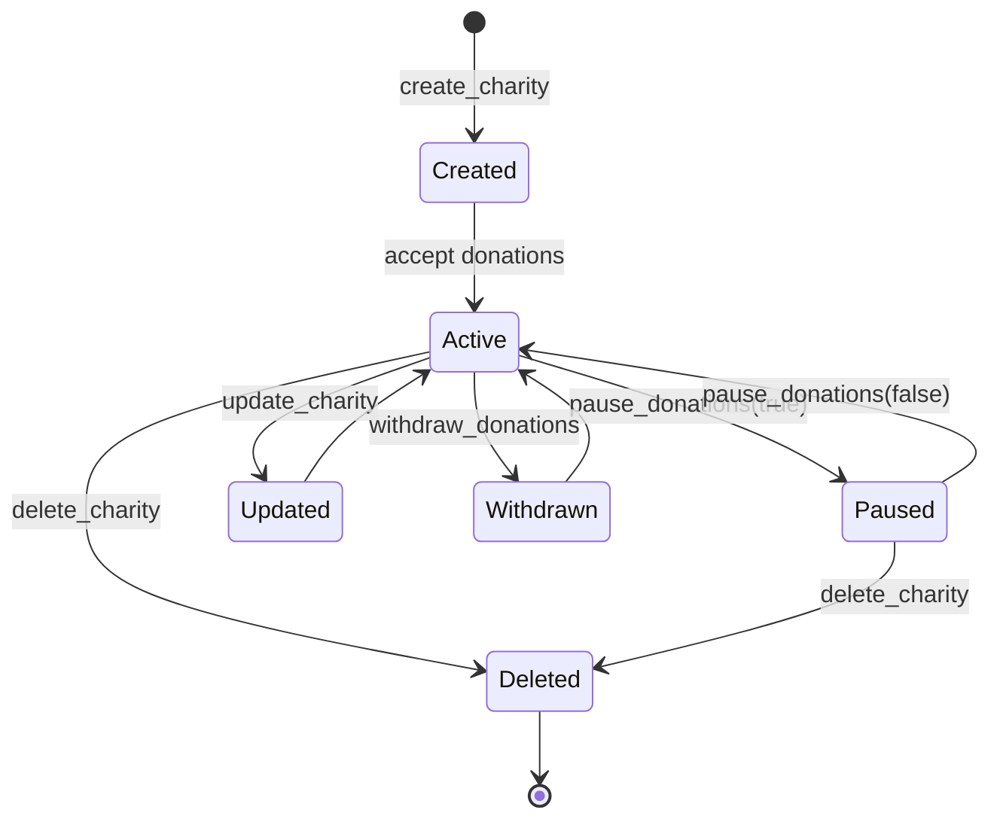

# Instructions

This section provides detailed documentation for each instruction in the charity program, including parameters, account requirements, validation logic, and usage examples.

## Understanding Smart Contract Instructions

Smart contract instructions are the only way to modify blockchain state. Unlike traditional database operations, each instruction must:

**Declare Dependencies**: Specify exactly which accounts it will read or modify
**Validate Inputs**: Check all parameters and account states before making changes  
**Execute Atomically**: Either complete entirely or fail with no state changes
**Emit Events**: Provide transparency about what operations occurred

## Design Principles

Our instruction design follows key principles for security and usability:

**Fail Fast**: Validate everything upfront before making any state changes
**Single Responsibility**: Each instruction has one clear purpose  
**Minimal Trust**: Rely on cryptographic proofs rather than assumptions
**Cost Efficiency**: Optimize for minimal compute units and transaction fees
**User Safety**: Prevent common mistakes through validation and clear error messages

## Security Considerations

Each instruction implements multiple layers of security:

**Account Validation**: Anchor automatically verifies account ownership and constraints
**Authorization Checks**: Instructions verify the signer has permission for the operation
**State Validation**: Business logic ensures operations are valid in the current context
**Overflow Protection**: All arithmetic uses checked operations to prevent manipulation
**Reentrancy Safety**: State changes are atomic and cannot be interrupted maliciously

## Instruction Overview

The charity program implements six core instructions:

| Instruction | Purpose | Authority Required | Mutates State |
|-------------|---------|-------------------|---------------|
| `create_charity` | Create new charity account | Yes (creator) | Yes |
| `donate_sol` | Transfer SOL to charity | No | Yes |
| `withdraw_donations` | Withdraw funds from charity | Yes (charity owner) | Yes |
| `update_charity` | Update charity description | Yes (charity owner) | Yes |
| `pause_donations` | Toggle donation acceptance | Yes (charity owner) | Yes |
| `delete_charity` | Remove charity and withdraw funds | Yes (charity owner) | Yes |

## create_charity

Creates a new charity account with an associated vault for storing donations.

### Purpose and Rationale

The `create_charity` instruction establishes a new charity organization on the blockchain. This instruction serves several critical functions:

**Identity Establishment**: Creates a unique, verifiable identity for the charity organization that cannot be impersonated.

**Fund Security**: Establishes a separate vault account that only the program can control, ensuring donated funds cannot be stolen.

**Access Control**: Links the charity to an authority (owner) who has exclusive rights to manage the charity and access funds.

**Transparency**: All charity creation events are publicly recorded, providing complete transparency about when and by whom charities are established.

### Parameters

```rust
pub fn create_charity(
    ctx: Context<CreateCharity>,
    name: String,        // Charity name (max 30 characters)
    description: String, // Charity description (max 100 characters)
) -> Result<()>
```

### Key Design Decisions

**Name and Description Limits**: The 30-character name limit balances expressiveness with storage efficiency. Most charity names fit comfortably while preventing abuse.

**PDA Usage**: Using Program Derived Addresses ensures each authority can only create one charity with a given name, preventing namespace conflicts.

**Separate Vault**: The vault account is separate from the charity metadata to isolate financial risk from informational updates.

### Account Context

The account context defines exactly which accounts this instruction needs and how they must be configured.

```rust
#[derive(Accounts)]
#[instruction(name: String)]
pub struct CreateCharity<'info> {
    #[account(
        init,
        payer = authority,
        space = 8 + Charity::INIT_SPACE,
        seeds = [b"charity", authority.key().as_ref(), name.as_bytes()],
        bump
    )]
    pub charity: Account<'info, Charity>,

    #[account(
        init,
        payer = authority,
        space = 0,
        seeds = [b"vault", charity.key().as_ref()],
        bump
    )]
    pub vault: SystemAccount<'info>,

    #[account(mut)]
    pub authority: Signer<'info>,

    pub system_program: Program<'info, System>,
}
```

### Validation Rules

- **Name Length**: Max 30 characters
- **Description Length**: Max 100 characters  
- **Uniqueness**: Each authority can only create one charity with a given name
- **Rent**: Authority must have sufficient SOL for rent exemption

### State Changes

- Creates new `Charity` account with initial values
- Creates associated `vault` PDA for donations
- Sets `authority` as charity owner
- Initializes counters to zero
- Records creation timestamp

### Events Emitted

```rust
emit!(CreateCharityEvent {
    charity_key: charity.key(),
    charity_name: name,
    description,
    authority: ctx.accounts.authority.key(),
    created_at: current_time,
});
```

### Usage Example

```typescript
await program.methods
  .createCharity("Clean Water Initiative", "Providing clean water to rural communities")
  .accounts({
    authority: wallet.publicKey,
  })
  .rpc();
```

### Context Analysis

**Charity Account**: Uses `init` constraint to create a new account. The PDA seeds ensure uniqueness and deterministic addressing.

**Vault Account**: Also uses `init` with zero space - it only holds SOL, no custom data.

**Authority**: Must be a signer and pays for account creation rent.

**System Program**: Required for account creation operations.

This structure ensures that:
- Only the authority can create the charity
- Account addresses are deterministic and unique
- The creator pays all associated costs
- Both accounts are properly initialized and owned

## donate_sol

Transfers SOL from a donor's wallet to a charity's vault.

### Purpose and Rationale

The `donate_sol` instruction is the core function that enables charitable giving on the blockchain. This instruction is designed with several key principles:

**Trustless Giving**: Donors can send funds directly without trusting intermediaries or worrying about funds being redirected.

**Transparency**: All donations are recorded on-chain with full transparency about amounts, donors, and recipients.

**Efficiency**: Direct transfers minimize fees and complexity compared to traditional payment processors.

**Immutable Records**: Once a donation is made, it becomes part of the permanent blockchain record that cannot be altered or deleted.

### Parameters

```rust
pub fn donate_sol(
    ctx: Context<DonateSol>,
    amount: u64,  // Amount in lamports to donate
) -> Result<()>
```

### Security Design

**Pause Protection**: The instruction checks if donations are paused, allowing charity owners to halt incoming funds during emergencies or maintenance.

**Amount Validation**: While not shown in the parameters, the instruction validates donation amounts to prevent overflow attacks and ensure reasonable limits.

**Atomic Operations**: The SOL transfer and state updates happen atomically - either both succeed or both fail, preventing inconsistent state.

### Account Context

The account context shows how donations flow through the system safely:

```rust
#[derive(Accounts)]
pub struct DonateSol<'info> {
    #[account(
        mut,
        seeds = [b"charity", charity.authority.as_ref(), charity.name.as_bytes()],
        bump = charity.vault_bump
    )]
    pub charity: Account<'info, Charity>,

    #[account(
        mut,
        seeds = [b"vault", charity.key().as_ref()],
        bump = charity.vault_bump
    )]
    pub vault: SystemAccount<'info>,

    #[account(mut)]
    pub donor: Signer<'info>,

    pub system_program: Program<'info, System>,
}
```

### Context Analysis

**Charity Account**: Must exist and be mutable to update donation counters. The seeds verification ensures we're donating to a legitimate charity.

**Vault Account**: The destination for SOL funds. Uses PDA to ensure only the program can control these funds.

**Donor Account**: Must be mutable (loses SOL) and sign the transaction (proves consent).

**System Program**: Required for SOL transfers between accounts.

### Validation Rules

- **Charity Active**: Charity must not be paused or deleted
- **Amount Bounds**: 0.001 SOL ≤ amount ≤ 100 SOL
- **Donor Balance**: Donor must have sufficient funds
- **Overflow Protection**: Total donations must not overflow

### State Changes

- Transfers SOL from donor to charity vault
- Increments `donations_in_lamports` by donation amount
- Increments `donation_count` by 1
- Updates `updated_at` timestamp
- Creates donation record (optional)

### Events Emitted

```rust
emit!(MakeDonationEvent {
    donor_key: donor.key(),
    charity_key: charity.key(),
    charity_name: charity.name.clone(),
    amount,
    total_donations: charity.donations_in_lamports + amount,
    donation_count: charity.donation_count + 1,
    created_at: current_time,
});
```

### Usage Example

```typescript
// Donate 0.1 SOL
const amount = 0.1 * LAMPORTS_PER_SOL;

await program.methods
  .donateSol(new BN(amount))
  .accounts({
    charity: charityPda,
    donor: wallet.publicKey,
  })
  .rpc();
```

### Donation Flow Security

The donation process implements multiple security layers:

1. **Pre-flight Checks**: Charity status and amount validation before any transfers
2. **Controlled Transfer**: SOL goes directly to program-controlled vault, not to individuals  
3. **State Consistency**: Donation counters and amounts are updated atomically with the transfer
4. **Event Logging**: Complete transaction details are recorded for transparency
5. **Overflow Protection**: All arithmetic uses checked operations to prevent manipulation

This design ensures that donations are secure, transparent, and cannot be intercepted or manipulated.

## withdraw_donations

Allows charity authority to withdraw funds from the charity vault.

### Purpose and Rationale

The `withdraw_donations` instruction enables charity owners to access the funds donated to their organization. This instruction balances accessibility with security:

**Authorized Access**: Only the charity authority can withdraw funds, preventing theft or unauthorized access.

**Rent Protection**: The instruction ensures enough SOL remains to keep the vault account rent-exempt, preventing account deletion.

**Transparent Operations**: All withdrawals are logged with complete details for public accountability.

**Flexible Recipients**: Funds can be withdrawn to any address, allowing charities to send money directly where it's needed.

### Parameters

```rust
pub fn withdraw_donations(
    ctx: Context<WithdrawDonations>,
    amount: u64,      // Amount in lamports to withdraw
) -> Result<()>
```

### Security Considerations

**Authorization Enforcement**: The `has_one = authority` constraint ensures only the charity owner can withdraw funds.

**Rent Exemption Protection**: The instruction calculates minimum rent requirements and prevents withdrawals that would make the vault account deletable.

**Amount Validation**: Withdrawals cannot exceed available funds, and the instruction checks for sufficient vault balance.

**Direct Lamport Manipulation**: Rather than using system program transfers, the instruction directly manipulates lamport balances for efficiency with program-owned accounts.

### Account Context

```rust
#[derive(Accounts)]
pub struct WithdrawDonations<'info> {
    #[account(
        mut,
        has_one = authority @ CustomError::Unauthorized,
        seeds = [b"charity", authority.key().as_ref(), charity.name.as_bytes()],
        bump = charity.vault_bump
    )]
    pub charity: Account<'info, Charity>,

    #[account(
        mut,
        seeds = [b"vault", charity.key().as_ref()],
        bump = charity.vault_bump
    )]
    pub vault: SystemAccount<'info>,

    #[account(mut)]
    pub authority: Signer<'info>,

    /// CHECK: Recipient can be any valid address
    #[account(mut)]
    pub recipient: UncheckedAccount<'info>,

    pub system_program: Program<'info, System>,
}
```

### Context Analysis

**Charity Account**: Uses `has_one` constraint to verify the signer is the authorized owner.

**Vault Account**: Source of funds. PDA verification ensures we're accessing the correct vault.

**Authority**: Must sign to prove authorization for the withdrawal.

**Recipient**: Uses `UncheckedAccount` because it can be any valid Solana address. The `/// CHECK` comment documents this intentional flexibility.

### Validation Rules

- **Authority Check**: Only charity authority can withdraw
- **Charity Active**: Charity must not be deleted
- **Sufficient Funds**: Vault must have enough balance
- **Rent Protection**: Must maintain rent-exempt balance
- **Valid Recipient**: Recipient address must be valid

### State Changes

- Transfers SOL from vault to recipient
- Updates `withdrawn_at` timestamp
- Does not modify donation counters (historical record)

### Events Emitted

```rust
emit!(WithdrawDonationsEvent {
    charity_key: charity.key(),
    charity_name: charity.name.clone(),
    authority: authority.key(),
    recipient,
    amount,
    remaining_balance: vault.lamports() - amount,
    withdrawn_at: current_time,
});
```

### Usage Example

```typescript
// Withdraw 0.5 SOL to authority wallet
const amount = 0.5 * LAMPORTS_PER_SOL;

await program.methods
  .withdrawDonations(new BN(amount), wallet.publicKey)
  .accounts({
    charity: charityPda,
    authority: wallet.publicKey,
    recipient: wallet.publicKey,
  })
  .rpc();
```

### Withdrawal Security Model

The withdrawal process implements a defense-in-depth security model:

1. **Authentication**: Only the charity authority can initiate withdrawals
2. **Authorization**: Anchor constraints verify the relationship between signer and charity  
3. **Validation**: Amount and balance checks prevent invalid operations
4. **Preservation**: Rent exemption is maintained to prevent account deletion
5. **Transparency**: All withdrawals are logged with complete transaction details

This multi-layered approach ensures funds can only be accessed by legitimate charity owners while maintaining system integrity.

## update_charity

Updates the description of an existing charity.

### Purpose and Rationale

The `update_charity` instruction allows charity organizations to modify their description while preserving all other data. This instruction serves important operational needs:

**Evolving Missions**: Charities may need to update their mission statements or focus areas over time.

**Correcting Information**: Allows fixing typos or clarifying unclear descriptions without losing donation history.

**Transparency**: All updates are timestamped and logged, creating an audit trail of changes.

**Limited Scope**: Only the description can be changed - the name and core identity remain immutable to prevent confusion or impersonation.

### Parameters

```rust
pub fn update_charity(
    ctx: Context<UpdateCharity>,
    description: String, // New description (max 100 characters)
) -> Result<()>
```

### Account Context

```rust
#[derive(Accounts)]
pub struct UpdateCharity<'info> {
    #[account(
        mut,
        has_one = authority @ CustomError::Unauthorized,
        seeds = [b"charity", authority.key().as_ref(), charity.name.as_bytes()],
        bump = charity.vault_bump
    )]
    pub charity: Account<'info, Charity>,

    pub authority: Signer<'info>,
}
```

### Validation Rules

- **Authority Check**: Only charity authority can update
- **Charity Active**: Charity must not be deleted
- **Description Length**: Max 100 characters
- **Content Validation**: Basic sanitization checks

### State Changes

- Updates `description` field
- Updates `updated_at` timestamp
- Preserves all other charity data

### Events Emitted

```rust
emit!(UpdateCharityEvent {
    charity_key: charity.key(),
    charity_name: charity.name.clone(),
    old_description: old_description.clone(),
    new_description: description.clone(),
    authority: authority.key(),
    updated_at: current_time,
});
```

### Usage Example

```typescript
await program.methods
  .updateCharity("Updated mission: Providing clean water and sanitation facilities")
  .accounts({
    charity: charityPda,
    authority: wallet.publicKey,
  })
  .rpc();
```

### Update Design Philosophy

**Immutable Identity**: The charity name cannot be changed to prevent identity confusion and maintain donation targeting accuracy.

**Controlled Changes**: Only the description field can be modified, limiting the scope of potential changes.

**Change Validation**: The instruction prevents setting the description to the same value, avoiding unnecessary state changes and transaction fees.

**Audit Trail**: Every update is timestamped and logged, providing complete transparency about when and how charity information changed.

## pause_donations

Toggles the donation acceptance status for a charity.

### Purpose and Rationale

The `pause_donations` instruction provides charity owners with an emergency stop mechanism for incoming donations. This capability is essential for several scenarios:

**Emergency Response**: Allows immediate suspension of donations during crises, investigations, or operational issues.

**Maintenance Windows**: Enables temporary pausing during system maintenance or charity restructuring.

**Regulatory Compliance**: Provides a mechanism to halt operations if required by legal or regulatory authorities.

**Capacity Management**: Allows charities to pause donations when they've reached capacity or need time to process existing funds.

### Parameters

```rust
pub fn pause_donations(
    ctx: Context<PauseDonations>,
    paused: bool, // true to pause, false to unpause
) -> Result<()>
```

### Account Context

```rust
#[derive(Accounts)]
pub struct PauseDonations<'info> {
    #[account(
        mut,
        has_one = authority @ CustomError::Unauthorized,
        seeds = [b"charity", authority.key().as_ref(), charity.name.as_bytes()],
        bump = charity.vault_bump
    )]
    pub charity: Account<'info, Charity>,

    pub authority: Signer<'info>,
}
```

### Validation Rules

- **Authority Check**: Only charity authority can pause/unpause
- **Charity Active**: Charity must not be deleted
- **State Change**: New state must differ from current state

### State Changes

- Updates `paused` field
- Updates `updated_at` timestamp
- Affects future donation acceptance

### Events Emitted

```rust
emit!(PauseDonationsEvent {
    charity_key: charity.key(),
    charity_name: charity.name.clone(),
    authority: authority.key(),
    paused,
    timestamp: current_time,
});
```

### Usage Example

```typescript
// Pause donations
await program.methods
  .pauseDonations(true)
  .accounts({
    charity: charityPda,
    authority: wallet.publicKey,
  })
  .rpc();

// Resume donations
await program.methods
  .pauseDonations(false)
  .accounts({
    charity: charityPda,
    authority: wallet.publicKey,
  })
  .rpc();
```

### Pause Mechanism Design

**Simple Toggle**: The boolean parameter allows easy switching between paused and active states.

**Immediate Effect**: Once paused, new donations are immediately rejected until the charity is unpaused.

**Reversible**: Unlike deletion, pausing can be undone, making it safe for temporary situations.

**Transparent**: All pause/unpause actions are logged with timestamps for accountability.

**Access Control**: Only the charity authority can pause or unpause their organization.

## delete_charity

Permanently removes a charity and withdraws all remaining funds.

### Purpose and Rationale

The `delete_charity` instruction provides a permanent shutdown mechanism for charity organizations. This is the most serious operation in the system and is designed with multiple safeguards:

**Finality**: Deletion is irreversible - once executed, the charity cannot be restored.

**Fund Recovery**: All remaining funds are automatically withdrawn during deletion to prevent loss.

**Clean Shutdown**: Both the charity metadata and vault accounts are closed, returning rent to the authority.

**Recipient Flexibility**: Funds can be sent to a specified recipient address, allowing charities to direct final funds appropriately.

**Complete Audit Trail**: The deletion event logs final statistics and fund disposition for permanent record.

### Parameters

```rust
pub fn delete_charity(
    ctx: Context<DeleteCharity>,
) -> Result<()>
```

### Account Context

```rust
#[derive(Accounts)]
pub struct DeleteCharity<'info> {
    #[account(
        mut,
        has_one = authority @ CustomError::Unauthorized,
        seeds = [b"charity", authority.key().as_ref(), charity.name.as_bytes()],
        bump = charity.vault_bump,
        close = authority
    )]
    pub charity: Account<'info, Charity>,

    #[account(
        mut,
        seeds = [b"vault", charity.key().as_ref()],
        bump = charity.vault_bump
    )]
    pub vault: SystemAccount<'info>,

    #[account(mut)]
    pub authority: Signer<'info>,

    /// CHECK: Recipient can be any valid address
    #[account(mut)]
    pub recipient: UncheckedAccount<'info>,

    pub system_program: Program<'info, System>,
}
```

### Validation Rules

- **Authority Check**: Only charity authority can delete
- **Not Already Deleted**: Charity must not be already deleted
- **Valid Recipient**: Recipient address must be valid

### State Changes

- Transfers all vault funds to recipient
- Closes charity account (returns rent to authority)
- Closes vault account
- **Irreversible operation**

### Events Emitted

```rust
emit!(DeleteCharityEvent {
    charity_key: charity.key(),
    charity_name: charity.name.clone(),
    authority: authority.key(),
    final_balance: vault_balance,
    total_donations_received: charity.donations_in_lamports,
    total_donation_count: charity.donation_count,
    deleted_at: current_time,
});
```

### Usage Example

```typescript
await program.methods
  .deleteCharity(wallet.publicKey)
  .accounts({
    charity: charityPda,
    authority: wallet.publicKey,
    recipient: wallet.publicKey,
  })
  .rpc();
```

### Deletion Safety Mechanisms

**Authority Verification**: Only the charity owner can delete their organization.

**Automatic Fund Transfer**: The instruction automatically moves all vault funds to prevent loss.

**Recipient Logic**: If the recipient account exists and has funds, money goes there; otherwise it goes to the authority.

**Account Closure**: Both charity and vault accounts are properly closed to reclaim rent.

**Event Logging**: Complete deletion details are logged including final fund amounts and destination.

## Instruction Sequencing

Understanding the typical flow of instructions helps clarify how the charity system operates in practice.

### Typical Workflow

This represents the most common sequence of operations for a charity's lifecycle:

1. **Setup**: `create_charity` → Create charity and vault
2. **Operations**: `donate_sol` → Multiple donations from various users
3. **Management**: `update_charity`, `pause_donations` → Charity management
4. **Withdrawal**: `withdraw_donations` → Periodic fund withdrawals
5. **Cleanup**: `delete_charity` → Optional charity removal

### Workflow Rationale

**Linear Progression**: The workflow follows a logical progression from creation to operation to potential shutdown.

**Parallel Operations**: Once created, donations, updates, and withdrawals can happen in any order as needed.

**Optional Deletion**: Many charities will run indefinitely without ever being deleted.

**Emergency Procedures**: Pausing can happen at any time to handle emergencies or maintenance.

### State Transitions



### State Transition Analysis

The state diagram shows how charities flow through different operational states:

**Creation to Active**: New charities start accepting donations immediately.

**Active ↔ Paused**: Charities can be paused and unpaused as needed.

**Active to Updated**: Information updates don't change the operational state.

**Any State to Deleted**: Deletion is possible from any state and is permanent.

This design provides maximum operational flexibility while maintaining clear state boundaries.

## Error Handling

Each instruction implements comprehensive error handling designed to protect users and maintain system integrity:

### Error Handling Philosophy

**Fail Fast**: Errors are detected and reported as early as possible to prevent wasted computation and fees.

**Specific Messages**: Each error type provides clear information about what went wrong and why.

**Security First**: Error handling prevents attacks that might exploit edge cases or unexpected conditions.

**User Friendly**: Error messages are written to be understandable by end users, not just developers.

### Error Categories

- **Input Validation**: Parameter bounds and format checking
- **State Validation**: Account state and business rule validation
- **Authorization**: Access control verification
- **Financial Validation**: Sufficient funds and rent protection
- **Overflow Protection**: Arithmetic overflow prevention

## Gas Optimization

Instructions are carefully optimized for minimal compute unit usage, directly reducing user transaction costs:

### Optimization Strategies

**Early Validation**: Input validation happens before expensive operations. If a parameter is invalid, the transaction fails quickly without wasting compute units on unnecessary work.

**Efficient Account Access**: Instructions are designed to minimize the number of account reads and writes. Related state updates are batched together to reduce total access overhead.

**Batch Operations**: When multiple fields need updating (like donation counters and amounts), they're modified in a single operation rather than separate instructions.

**Optimal Account Sizing**: Account sizes are calculated precisely to avoid over-allocating space, which reduces rent costs for users.

**Direct Operations**: Where possible, instructions use direct lamport manipulation instead of system program calls for better efficiency.

### Cost Benefits

These optimizations provide tangible benefits to users:
- Lower transaction fees for all operations
- Faster transaction processing due to reduced compute usage
- More predictable costs due to efficient execution paths
- Better user experience through reliable performance

## Summary

This instruction set provides a complete charity management system with security, transparency, and efficiency as core design principles. Each instruction is carefully designed to:

- **Protect user funds** through multiple security layers
- **Provide transparency** through comprehensive event logging  
- **Minimize costs** through gas optimization
- **Ensure reliability** through robust error handling
- **Maintain flexibility** through thoughtful parameter design

The result is a trustworthy platform that enables secure, transparent charitable giving on the Solana blockchain.