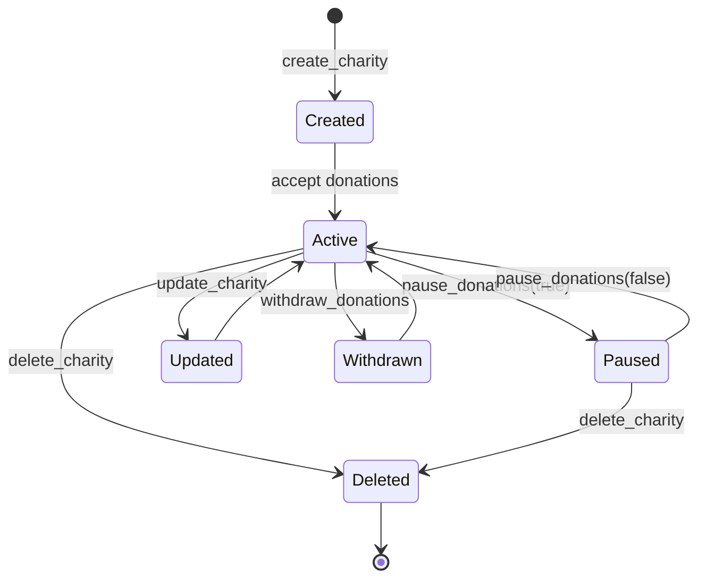

# Instructions

This section provides detailed documentation for each instruction in the charity program, including parameters, account requirements, validation logic, and usage examples.

## Instruction Overview

The charity program implements six core instructions:

| Instruction | Purpose | Authority Required | Mutates State |
|-------------|---------|-------------------|---------------|
| `create_charity` | Create new charity account | Yes (creator) | Yes |
| `donate_sol` | Transfer SOL to charity | No | Yes |
| `withdraw_donations` | Withdraw funds from charity | Yes (charity owner) | Yes |
| `update_charity` | Update charity description | Yes (charity owner) | Yes |
| `pause_donations` | Toggle donation acceptance | Yes (charity owner) | Yes |
| `delete_charity` | Remove charity and withdraw funds | Yes (charity owner) | Yes |

## create_charity

Creates a new charity account with an associated vault for storing donations.

### Parameters

```rust
pub fn create_charity(
    ctx: Context<CreateCharity>,
    name: String,        // Charity name (1-50 characters)
    description: String, // Charity description (1-200 characters)
) -> Result<()>
```

### Account Context

```rust
#[derive(Accounts)]
#[instruction(name: String)]
pub struct CreateCharity<'info> {
    #[account(
        init,
        payer = authority,
        space = 8 + Charity::INIT_SPACE,
        seeds = [b"charity", authority.key().as_ref(), name.as_bytes()],
        bump
    )]
    pub charity: Account<'info, Charity>,

    #[account(
        init,
        payer = authority,
        space = 0,
        seeds = [b"vault", charity.key().as_ref()],
        bump
    )]
    pub vault: SystemAccount<'info>,

    #[account(mut)]
    pub authority: Signer<'info>,

    pub system_program: Program<'info, System>,
}
```

### Validation Rules

- **Name Length**: 1-50 characters
- **Description Length**: 1-200 characters  
- **Uniqueness**: Each authority can only create one charity with a given name
- **Rent**: Authority must have sufficient SOL for rent exemption

### State Changes

- Creates new `Charity` account with initial values
- Creates associated `vault` PDA for donations
- Sets `authority` as charity owner
- Initializes counters to zero
- Records creation timestamp

### Events Emitted

```rust
emit!(CreateCharityEvent {
    charity_key: charity.key(),
    charity_name: name,
    description,
    authority: ctx.accounts.authority.key(),
    created_at: current_time,
});
```

### Usage Example

```typescript
await program.methods
  .createCharity("Clean Water Initiative", "Providing clean water to rural communities")
  .accounts({
    authority: wallet.publicKey,
  })
  .rpc();
```

## donate_sol

Transfers SOL from a donor's wallet to a charity's vault.

### Parameters

```rust
pub fn donate_sol(
    ctx: Context<DonateSol>,
    amount: u64,  // Amount in lamports to donate
) -> Result<()>
```

### Account Context

```rust
#[derive(Accounts)]
pub struct DonateSol<'info> {
    #[account(
        mut,
        seeds = [b"charity", charity.authority.as_ref(), charity.name.as_bytes()],
        bump = charity.vault_bump
    )]
    pub charity: Account<'info, Charity>,

    #[account(
        mut,
        seeds = [b"vault", charity.key().as_ref()],
        bump = charity.vault_bump
    )]
    pub vault: SystemAccount<'info>,

    #[account(mut)]
    pub donor: Signer<'info>,

    pub system_program: Program<'info, System>,
}
```

### Validation Rules

- **Charity Active**: Charity must not be paused or deleted
- **Amount Bounds**: 0.001 SOL ≤ amount ≤ 100 SOL
- **Donor Balance**: Donor must have sufficient funds
- **Overflow Protection**: Total donations must not overflow

### State Changes

- Transfers SOL from donor to charity vault
- Increments `donations_in_lamports` by donation amount
- Increments `donation_count` by 1
- Updates `updated_at` timestamp
- Creates donation record (optional)

### Events Emitted

```rust
emit!(MakeDonationEvent {
    donor_key: donor.key(),
    charity_key: charity.key(),
    charity_name: charity.name.clone(),
    amount,
    total_donations: charity.donations_in_lamports + amount,
    donation_count: charity.donation_count + 1,
    created_at: current_time,
});
```

### Usage Example

```typescript
// Donate 0.1 SOL
const amount = 0.1 * LAMPORTS_PER_SOL;

await program.methods
  .donateSol(new BN(amount))
  .accounts({
    charity: charityPda,
    donor: wallet.publicKey,
  })
  .rpc();
```

## withdraw_donations

Allows charity authority to withdraw funds from the charity vault.

### Parameters

```rust
pub fn withdraw_donations(
    ctx: Context<WithdrawDonations>,
    amount: u64,      // Amount in lamports to withdraw
    recipient: Pubkey, // Address to receive the funds
) -> Result<()>
```

### Account Context

```rust
#[derive(Accounts)]
pub struct WithdrawDonations<'info> {
    #[account(
        mut,
        has_one = authority @ CustomError::Unauthorized,
        seeds = [b"charity", authority.key().as_ref(), charity.name.as_bytes()],
        bump = charity.vault_bump
    )]
    pub charity: Account<'info, Charity>,

    #[account(
        mut,
        seeds = [b"vault", charity.key().as_ref()],
        bump = charity.vault_bump
    )]
    pub vault: SystemAccount<'info>,

    #[account(mut)]
    pub authority: Signer<'info>,

    /// CHECK: Recipient can be any valid address
    #[account(mut)]
    pub recipient: UncheckedAccount<'info>,

    pub system_program: Program<'info, System>,
}
```

### Validation Rules

- **Authority Check**: Only charity authority can withdraw
- **Charity Active**: Charity must not be deleted
- **Sufficient Funds**: Vault must have enough balance
- **Rent Protection**: Must maintain rent-exempt balance
- **Valid Recipient**: Recipient address must be valid

### State Changes

- Transfers SOL from vault to recipient
- Updates `withdrawn_at` timestamp
- Does not modify donation counters (historical record)

### Events Emitted

```rust
emit!(WithdrawDonationsEvent {
    charity_key: charity.key(),
    charity_name: charity.name.clone(),
    authority: authority.key(),
    recipient,
    amount,
    remaining_balance: vault.lamports() - amount,
    withdrawn_at: current_time,
});
```

### Usage Example

```typescript
// Withdraw 0.5 SOL to authority wallet
const amount = 0.5 * LAMPORTS_PER_SOL;

await program.methods
  .withdrawDonations(new BN(amount), wallet.publicKey)
  .accounts({
    charity: charityPda,
    authority: wallet.publicKey,
    recipient: wallet.publicKey,
  })
  .rpc();
```

## update_charity

Updates the description of an existing charity.

### Parameters

```rust
pub fn update_charity(
    ctx: Context<UpdateCharity>,
    description: String, // New description (1-200 characters)
) -> Result<()>
```

### Account Context

```rust
#[derive(Accounts)]
pub struct UpdateCharity<'info> {
    #[account(
        mut,
        has_one = authority @ CustomError::Unauthorized,
        seeds = [b"charity", authority.key().as_ref(), charity.name.as_bytes()],
        bump = charity.vault_bump
    )]
    pub charity: Account<'info, Charity>,

    pub authority: Signer<'info>,
}
```

### Validation Rules

- **Authority Check**: Only charity authority can update
- **Charity Active**: Charity must not be deleted
- **Description Length**: 1-200 characters
- **Content Validation**: Basic sanitization checks

### State Changes

- Updates `description` field
- Updates `updated_at` timestamp
- Preserves all other charity data

### Events Emitted

```rust
emit!(UpdateCharityEvent {
    charity_key: charity.key(),
    charity_name: charity.name.clone(),
    old_description: old_description.clone(),
    new_description: description.clone(),
    authority: authority.key(),
    updated_at: current_time,
});
```

### Usage Example

```typescript
await program.methods
  .updateCharity("Updated mission: Providing clean water and sanitation facilities")
  .accounts({
    charity: charityPda,
    authority: wallet.publicKey,
  })
  .rpc();
```

## pause_donations

Toggles the donation acceptance status for a charity.

### Parameters

```rust
pub fn pause_donations(
    ctx: Context<PauseDonations>,
    paused: bool, // true to pause, false to unpause
) -> Result<()>
```

### Account Context

```rust
#[derive(Accounts)]
pub struct PauseDonations<'info> {
    #[account(
        mut,
        has_one = authority @ CustomError::Unauthorized,
        seeds = [b"charity", authority.key().as_ref(), charity.name.as_bytes()],
        bump = charity.vault_bump
    )]
    pub charity: Account<'info, Charity>,

    pub authority: Signer<'info>,
}
```

### Validation Rules

- **Authority Check**: Only charity authority can pause/unpause
- **Charity Active**: Charity must not be deleted
- **State Change**: New state must differ from current state

### State Changes

- Updates `paused` field
- Updates `updated_at` timestamp
- Affects future donation acceptance

### Events Emitted

```rust
emit!(PauseDonationsEvent {
    charity_key: charity.key(),
    charity_name: charity.name.clone(),
    authority: authority.key(),
    paused,
    timestamp: current_time,
});
```

### Usage Example

```typescript
// Pause donations
await program.methods
  .pauseDonations(true)
  .accounts({
    charity: charityPda,
    authority: wallet.publicKey,
  })
  .rpc();

// Resume donations
await program.methods
  .pauseDonations(false)
  .accounts({
    charity: charityPda,
    authority: wallet.publicKey,
  })
  .rpc();
```

## delete_charity

Permanently removes a charity and withdraws all remaining funds.

### Parameters

```rust
pub fn delete_charity(
    ctx: Context<DeleteCharity>,
    recipient: Pubkey, // Address to receive remaining funds
) -> Result<()>
```

### Account Context

```rust
#[derive(Accounts)]
pub struct DeleteCharity<'info> {
    #[account(
        mut,
        has_one = authority @ CustomError::Unauthorized,
        seeds = [b"charity", authority.key().as_ref(), charity.name.as_bytes()],
        bump = charity.vault_bump,
        close = authority
    )]
    pub charity: Account<'info, Charity>,

    #[account(
        mut,
        seeds = [b"vault", charity.key().as_ref()],
        bump = charity.vault_bump
    )]
    pub vault: SystemAccount<'info>,

    #[account(mut)]
    pub authority: Signer<'info>,

    /// CHECK: Recipient can be any valid address
    #[account(mut)]
    pub recipient: UncheckedAccount<'info>,

    pub system_program: Program<'info, System>,
}
```

### Validation Rules

- **Authority Check**: Only charity authority can delete
- **Not Already Deleted**: Charity must not be already deleted
- **Valid Recipient**: Recipient address must be valid

### State Changes

- Transfers all vault funds to recipient
- Closes charity account (returns rent to authority)
- Closes vault account
- **Irreversible operation**

### Events Emitted

```rust
emit!(DeleteCharityEvent {
    charity_key: charity.key(),
    charity_name: charity.name.clone(),
    authority: authority.key(),
    final_balance: vault_balance,
    total_donations_received: charity.donations_in_lamports,
    total_donation_count: charity.donation_count,
    deleted_at: current_time,
});
```

### Usage Example

```typescript
await program.methods
  .deleteCharity(wallet.publicKey)
  .accounts({
    charity: charityPda,
    authority: wallet.publicKey,
    recipient: wallet.publicKey,
  })
  .rpc();
```

## Instruction Sequencing

### Typical Workflow

1. **Setup**: `create_charity` → Create charity and vault
2. **Operations**: `donate_sol` → Multiple donations from various users
3. **Management**: `update_charity`, `pause_donations` → Charity management
4. **Withdrawal**: `withdraw_donations` → Periodic fund withdrawals
5. **Cleanup**: `delete_charity` → Optional charity removal

### State Transitions



## Error Handling

Each instruction implements comprehensive error handling:

- **Input Validation**: Parameter bounds and format checking
- **State Validation**: Account state and business rule validation
- **Authorization**: Access control verification
- **Financial Validation**: Sufficient funds and rent protection
- **Overflow Protection**: Arithmetic overflow prevention

## Gas Optimization

Instructions are optimized for minimal compute unit usage:

- **Early Validation**: Fail fast on invalid inputs
- **Efficient Account Access**: Minimal account reads/writes
- **Batch Operations**: Multiple state updates in single transaction
- **Optimal Account Sizing**: Precise space allocation

This instruction set provides a complete charity management system with security, transparency, and efficiency as core design principles.